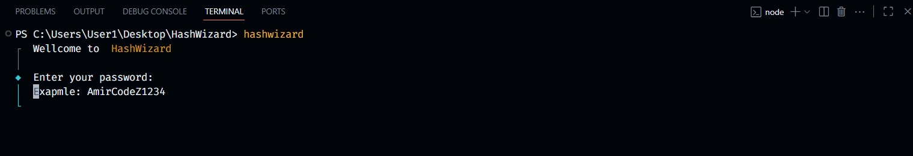
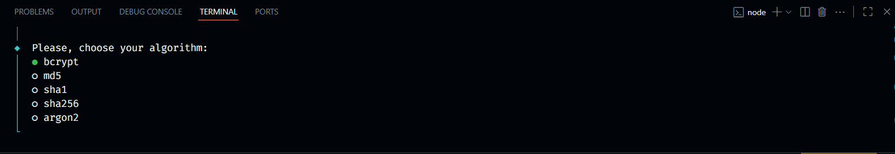
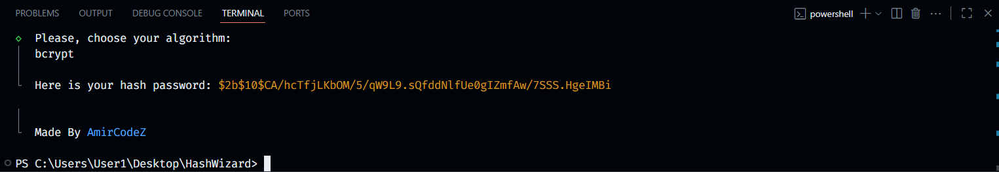

# 🧙‍♂️ HashWizard

A **simple and fast tool to hash passwords in the terminal** 🖥️✨

## Features
- ✅ Choose your hashing algorithm: `MD5` 🧩 | `SHA1` 🔑 | `SHA256` 💎 | `Argon2` ⚡ | `Bcrypt` 🔒  
- ✅ Perfect for testing password security 👨‍💻  
- ✅ Instant hash generation ⚡  

## Installation
Install via npm:

```bash
npm i -g hashwizard
```

### Usage
Type this in your terminl to run:

```sh
hashwizard
```

1. First, answer the first question. (Enter your password?) Default value is **AmirCodeZ1234**:



2. Next, choose the algorithm to hash the password (Default value is bcrypt):


3. Finally, you will see a success message, indicating that your hashed password has been created:



**Made by AmirCodeZ**
